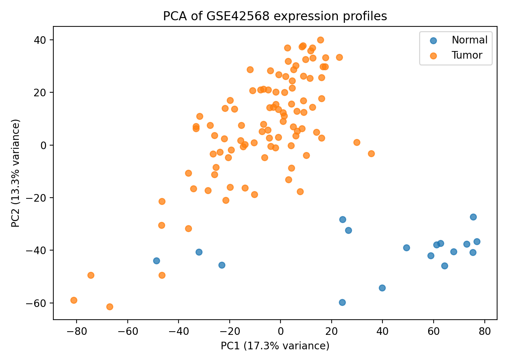
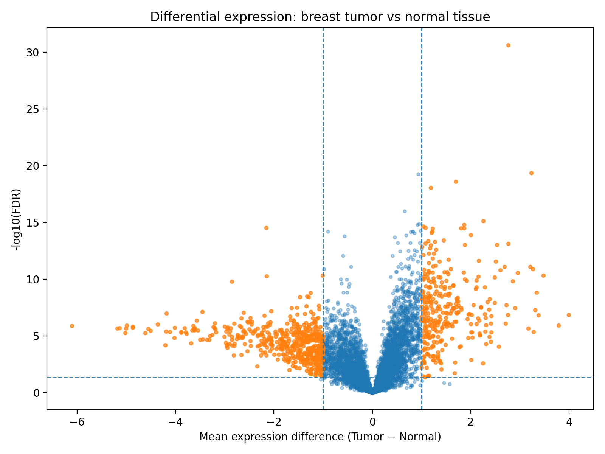
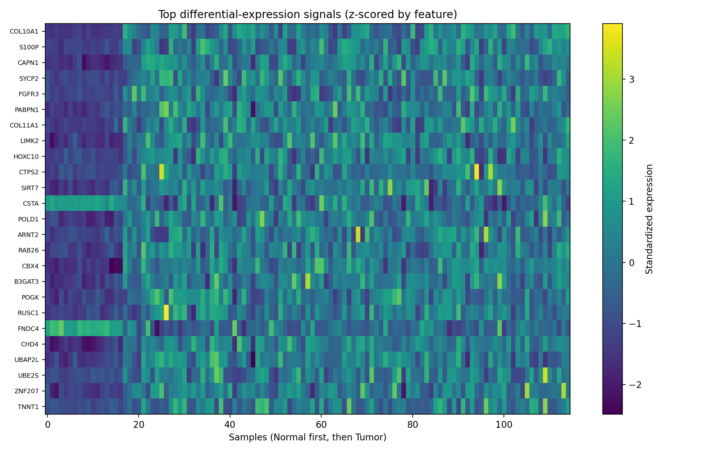

# Breast Cancer Transcriptomic Signature Analysis — GSE42568

> A reproducible transcriptomics analysis comparing breast tumor and normal breast tissue using publicly available gene-expression data.

**Python · Transcriptomics · Differential Expression · PCA · FDR · GO/KEGG Enrichment**

---

## Project Overview

Breast cancer is associated with large-scale changes in gene-expression programs.

This project analyzes publicly available breast-cancer transcriptomic data derived from **NCBI GEO accession GSE42568** to investigate:

> **Which genes show significant expression differences between breast tumor and normal breast tissue, and which biological processes are represented among those genes?**

The workflow combines statistical testing, dimensionality reduction, gene annotation, visualization, and pathway enrichment to move from a high-dimensional expression matrix to biologically interpretable results.

---

## Dataset

| Property | Value |
|---|---:|
| GEO accession | GSE42568 |
| Organism | *Homo sapiens* |
| Technology | Affymetrix Human Genome U133 Plus 2.0 microarray |
| Samples analyzed | **115** |
| Tumor samples | **98** |
| Normal samples | **17** |
| Gene-level features tested | **7,897** |
| Gene IDs successfully mapped | **7,897** |

The original GEO study contains 104 breast-cancer samples and 17 normal breast-tissue samples.

This project currently analyzes a processed Zenodo version containing **98 tumor and 17 normal samples**, so all reported results correspond specifically to the **115 samples actually analyzed**.

### Data Sources

- **NCBI GEO:** GSE42568  
  https://www.ncbi.nlm.nih.gov/geo/query/acc.cgi?acc=GSE42568

- **Processed dataset:** Zenodo  
  DOI: https://doi.org/10.5281/zenodo.4846212

---

# Analysis Workflow

```text
Public expression data
        │
        ▼
Sample / feature inspection
        │
        ▼
Quality control
        │
        ▼
Gene ID annotation
        │
        ├──────────────► PCA
        │
        ▼
Tumor vs Normal comparison
        │
        ▼
Welch's t-test
        │
        ▼
Benjamini-Hochberg FDR correction
        │
        ▼
Differentially expressed genes
        │
        ├──────────────► Volcano plot
        │
        ├──────────────► Heatmap
        │
        ▼
GO + KEGG pathway enrichment
```

---

# Results

## 1. Global Expression Structure — PCA

Principal Component Analysis was used to examine major patterns in the expression profiles without using the tumor/normal label to construct the components.

| Component | Variance Explained |
|---|---:|
| PC1 | **17.3%** |
| PC2 | **13.3%** |
| PC1 + PC2 | **30.6%** |



### Interpretation

Normal breast samples occupy a relatively distinct region of the PCA space, particularly along PC2, while most tumor samples show substantially different global expression profiles.

The separation is not perfect: several tumor samples extend toward the normal region.

This is consistent with **heterogeneity among breast tumors** and demonstrates that the tumor-normal distinction is reflected across many expression features rather than a single gene.

---

## 2. Differential Expression

Expression was compared between tumor and normal breast tissue using **Welch's t-test**.

Because thousands of genes were tested simultaneously, p-values were corrected using the **Benjamini-Hochberg false discovery rate (FDR)**.

For this exploratory analysis, genes were considered significant when:

```text
FDR < 0.05
AND
|Tumor mean − Normal mean| >= 1
```

### Differential Expression Summary

| Metric | Result |
|---|---:|
| Genes tested | **7,897** |
| Significant genes under current threshold | **846** |
| FDR threshold | **0.05** |
| Absolute expression-difference threshold | **1.0** |

---

## Top Differential-Expression Signals

The following table shows several of the strongest significant genes ranked by FDR.

| Gene | Mean Tumor | Mean Normal | Tumor − Normal | FDR | Direction |
|---|---:|---:|---:|---:|---|
| **COL10A1** | 7.260 | 4.499 | **+2.761** | 2.26e-31 | ↑ Tumor |
| **S100P** | 8.128 | 4.898 | **+3.230** | 4.34e-20 | ↑ Tumor |
| **SYCP2** | 4.577 | 2.886 | **+1.691** | 2.51e-19 | ↑ Tumor |
| **FGFR3** | 4.981 | 3.799 | **+1.182** | 8.95e-19 | ↑ Tumor |
| **COL11A1** | 5.755 | 3.501 | **+2.255** | 7.52e-16 | ↑ Tumor |
| **HOXC10** | 6.494 | 4.629 | **+1.865** | 1.56e-15 | ↑ Tumor |
| **SIRT7** | 7.211 | 6.177 | **+1.033** | 2.23e-15 | ↑ Tumor |
| **CSTA** | 8.196 | 10.349 | **−2.153** | 2.99e-15 | ↓ Tumor |
| **POLD1** | 6.252 | 5.175 | **+1.077** | 3.08e-15 | ↑ Tumor |
| **RAB26** | 6.380 | 4.577 | **+1.804** | 3.19e-15 | ↑ Tumor |

Positive differences indicate higher expression in tumor tissue, while negative differences indicate lower expression in tumor tissue.

---

## 3. Volcano Plot

The volcano plot combines:

- **effect size** on the x-axis
- **statistical evidence** on the y-axis

Genes farther from zero have larger tumor-normal expression differences, while genes higher on the plot have stronger statistical evidence after FDR correction.



The plot shows strong signals in both directions, indicating that breast tumor tissue contains both substantially increased and substantially decreased gene-expression programs.

---

## 4. Expression Heatmap

The heatmap shows standardized expression values for some of the strongest differential-expression signals across individual samples.



The first columns correspond to normal breast samples, followed by tumor samples.

Several genes show clear group-associated shifts, including:

- **COL10A1**
- **S100P**
- **FGFR3**
- **COL11A1**
- **HOXC10**
- **CSTA**

The visualization supports the PCA and differential-expression results: the tumor-normal distinction is represented by a **multi-gene transcriptional pattern**, rather than a single isolated feature.

---

# Pathway Enrichment

Significant genes were submitted to **Enrichr** for functional enrichment against:

- Gene Ontology Biological Process
- KEGG Human pathways

---

## Top GO Biological Process Results

| Rank | Biological Process | Adjusted p-value |
|---:|---|---:|
| 1 | Regulation of Cell Population Proliferation | **1.71e-09** |
| 2 | Positive Regulation of Cell Population Proliferation | **3.33e-09** |
| 3 | Positive Regulation of Multicellular Organismal Process | **5.48e-08** |
| 4 | Positive Regulation of Cellular Process | **3.34e-07** |
| 5 | Regulation of Cold-Induced Thermogenesis | **2.52e-06** |

Additional enriched processes included:

- receptor protein tyrosine kinase signaling
- PI3K signaling
- cell migration
- cell differentiation
- MAPK signaling
- epithelial-to-mesenchymal transition
- regulation of apoptosis
- mitotic checkpoint signaling

---

## Top KEGG Pathway Results

| Rank | KEGG Pathway | Adjusted p-value |
|---:|---|---:|
| 1 | **PPAR signaling pathway** | 7.83e-05 |
| 2 | **Pyruvate metabolism** | 2.90e-04 |
| 3 | **Proteoglycans in cancer** | 3.34e-04 |
| 4 | **MAPK signaling pathway** | 3.34e-04 |
| 5 | **Rap1 signaling pathway** | 3.34e-04 |
| 6 | Fatty acid degradation | 4.30e-04 |
| 7 | **PI3K-Akt signaling pathway** | 4.30e-04 |
| 8 | Proximal tubule bicarbonate reclamation | 5.81e-04 |
| 9 | Tyrosine metabolism | 8.07e-04 |
| 10 | Cysteine and methionine metabolism | 8.59e-04 |

---

## Biological Interpretation

Several themes emerge from the enrichment results.

### Cell proliferation and signaling

The strongest GO enrichment involves regulation of **cell population proliferation**.

Additional enrichment was observed in signaling pathways involving:

- receptor tyrosine kinases
- PI3K
- MAPK
- Rap1

These results indicate that many of the differentially expressed genes participate in pathways involved in cellular growth, signaling, differentiation, and migration.

### Cancer-related pathways

KEGG enrichment included:

- **Proteoglycans in cancer**
- **MAPK signaling**
- **PI3K-Akt signaling**

These pathways contain multiple genes identified in the tumor-normal differential-expression analysis.

### Metabolic signatures

The analysis also identified enrichment related to:

- PPAR signaling
- fatty-acid degradation
- pyruvate metabolism
- AMPK signaling
- adipocyte-related biological processes

Several genes associated with lipid and adipose biology showed strong tumor-normal differences.

Because this is **bulk breast tissue**, these patterns should not automatically be interpreted as molecular changes occurring only within cancer cells.

Breast tumors and normal breast tissue can contain different proportions of:

- epithelial cells
- adipocytes
- fibroblasts
- immune cells
- stromal cells

Therefore, some expression differences may reflect changes in **tissue composition and the tumor microenvironment** in addition to tumor-cell biology.

---

# Statistical Methods

## Welch's t-test

Welch's t-test was used because:

- the tumor and normal groups have unequal sample sizes
- the groups are not required to have equal variance

For each gene, the null hypothesis was that tumor and normal samples have the same mean expression.

---

## Multiple Hypothesis Testing

Testing thousands of genes produces false-positive results simply by chance.

The **Benjamini-Hochberg procedure** was therefore used to control the false discovery rate.

An FDR threshold of 0.05 does **not** mean that each selected gene has a 95% probability of being a true cancer-associated gene.

Instead, FDR controls the expected proportion of false discoveries among the group of results declared significant.

---

# Important Limitations

This analysis should be interpreted with several limitations in mind:

1. **Microarray rather than RNA-seq**

   GSE42568 was generated using Affymetrix microarray technology.

2. **Processed subset**

   The processed dataset used here contains 98 tumor samples rather than all 104 tumors present in the original GEO study.

3. **Unequal sample sizes**

   The analysis contains 98 tumor samples but only 17 normal samples.

4. **Bulk tissue**

   Expression measurements reflect mixtures of multiple cell types.

5. **Association, not causation**

   Differential expression identifies genes associated with tumor status but does not establish that those genes cause cancer.

6. **Exploratory statistical approach**

   The current implementation uses Welch's t-test. A future version will use **limma**, an empirical-Bayes framework widely used for microarray differential-expression analysis.

7. **Combined pathway analysis**

   The current enrichment step combines upregulated and downregulated genes. Future analysis will examine both directions separately.

8. **No external validation yet**

   Findings should be tested in an independent breast-cancer cohort before being interpreted as robust biomarkers.

---

# Next Steps

Planned improvements include:

- [ ] Run differential-expression analysis using **limma**
- [ ] Analyze the official GEO cohort directly
- [ ] Separate **upregulated** and **downregulated** pathway enrichment
- [ ] Compare Welch/FDR results against limma results
- [ ] Validate major genes in an independent breast-cancer dataset
- [ ] Investigate selected genes using published biological literature
- [ ] Extend the workflow to RNA-seq data
- [ ] Explore single-cell RNA-seq as a follow-up project

---

# Repository Structure

```text
breast_cancer_transcriptomics_GSE42568/
│
├── data/
│   ├── raw/
│   └── processed/
│
├── notebooks/
│   └── GSE42568_analysis.ipynb
│
├── scripts/
│   └── run_analysis.py
│
├── results/
│   ├── figures/
│   │   ├── pca_tumor_vs_normal.png
│   │   ├── volcano_plot.png
│   │   └── top_gene_heatmap.png
│   │
│   └── tables/
│       ├── analysis_summary.csv
│       ├── differential_expression_all_probes.csv
│       ├── differential_expression_gene_level.csv
│       ├── pathway_enrichment.csv
│       ├── pca_coordinates.csv
│       ├── qc_summary.csv
│       └── significant_probes_fdr05_absdiff1.csv
│
├── LEARNING_GUIDE.md
├── requirements.txt
└── README.md
```

---

# Reproducing the Analysis

Install dependencies:

```bash
pip install -r requirements.txt
```

Run the complete analysis:

```bash
python scripts/run_analysis.py
```

Generated figures are written to:

```text
results/figures/
```

and analysis tables are written to:

```text
results/tables/
```

---

# Tools and Methods

| Area | Tools / Methods |
|---|---|
| Programming | Python |
| Data manipulation | pandas, NumPy |
| Statistical analysis | SciPy, statsmodels |
| Dimensionality reduction | scikit-learn PCA |
| Visualization | Matplotlib |
| Gene annotation | Entrez Gene IDs, MyGene.info |
| Differential expression | Welch's t-test |
| Multiple testing | Benjamini-Hochberg FDR |
| Functional analysis | Enrichr |
| Biological databases | Gene Ontology, KEGG |
| Data source | NCBI GEO |

---

# Author

**Siham Boumalak**  
M.S. Artificial Intelligence  
Northeastern University

Research interests: **biomedical informatics, computational biology, machine learning, trustworthy AI, NLP, and reproducible data analysis.**
